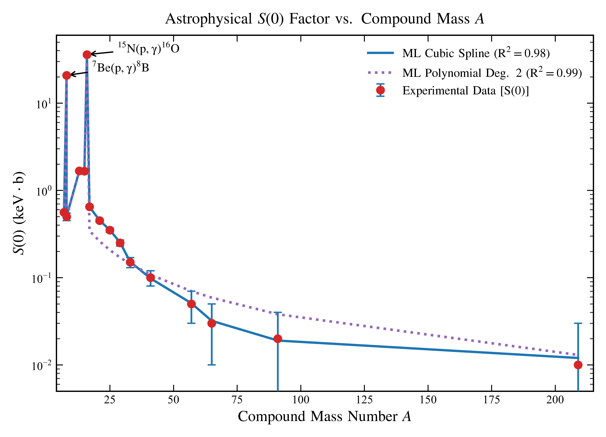

# Scientific Machine Learning for Astrophysical S-Factor & Maxwellian-Averaged Cross Sections (MACS)

[](https://www.python.org/)
[](#)
[](#)
[](LICENSE)

An open-source scientific machine learning (SciML) framework for non-linear extrapolation of low-energy radiative capture cross sections, astrophysical $S$-factors ($S(0)$), and thermalized Maxwellian-Averaged Cross Sections (MACS) across isotopic stellar burning networks.

---

## 🌌 Physical Problem & Motivation

In stellar nucleosynthesis (pp-chains, CNO cycles, helium burning, and advanced carbon/oxygen burning), nuclear reactions take place at center-of-mass energies far below the classical Coulomb barrier, within the narrow **Gamow energy window** ($E_0 \sim 10 - 300\text{ keV}$):

$$E_0 = \left( \frac{b k T}{2} \right)^{2/3} = 1.22 \left( Z_1^2 Z_2^2 \mu \, T_9^2 \right)^{1/3} \text{ keV}$$

Because the Coulomb barrier penetration probability drops exponentially as $E \to 0$, measured laboratory cross sections fall to picobarn or femtobarn levels ($\sigma \sim 10^{-12} - 10^{-15}\text{ b}$), making direct laboratory accelerator beam measurements unfeasible due to natural cosmic-ray and environmental background noise.

### The Astrophysical $S$-Factor Formalism

To isolate the non-nuclear Coulomb penetrability, the cross section $\sigma(E)$ is parameterized into the **Astrophysical $S$-factor**:

$$\sigma(E) = \frac{1}{E} S(E) \exp(-2\pi\eta)$$

where $\eta$ is the dimensionless **Sommerfeld parameter**:

$$\eta(E) = \frac{Z_1 Z_2 e^2}{\hbar v} = 0.15748 \, Z_1 Z_2 \sqrt{\frac{\mu \text{ (amu)}}{E \text{ (MeV)}}}$$

Here:
- $\mu = \frac{A_1 A_2}{A_1 + A_2}$ is the reduced mass of the colliding nuclei in amu.
- $Z_1, Z_2$ are the atomic numbers of the projectile and target.
- The factor $\exp(-2\pi\eta)$ represents the quantum mechanical transmission probability through the zero-angular-momentum ($s$-wave) barrier.

For non-resonant radiative capture, $S(E)$ varies smoothly and is conventionally expanded around zero energy:

$$S(E) \approx S(0) + S'(0)E + \frac{1}{2}S''(0)E^2$$

### Maxwellian-Averaged Cross Section (MACS)

To compute stellar reaction rates $N_A \langle \sigma v \rangle$ at stellar temperature $T$ (often parameterized as $T_9 = T / 10^9\text{ K}$), the cross section is integrated over a Maxwell-Boltzmann thermal velocity distribution:

$$\langle \sigma v \rangle = \left(\frac{8}{\pi \mu (k T)^3}\right)^{1/2} \int_0^\infty \sigma(E) E \exp\left(-\frac{E}{k T}\right) dE$$

Substituting the $S$-factor representation:

$$\langle \sigma v \rangle = \left(\frac{8}{\pi \mu (k T)^3}\right)^{1/2} \int_0^\infty S(E) \exp\left( - \frac{E}{k T} - 2\pi\eta(E) \right) dE$$

---

## 🔬 Experimental Reaction Catalog

This framework compiles experimental beam evaluations from the **IAEA EXFOR**, **NACRE II**, and **JINA REACLIB** databases across 17 benchmark radiative capture reactions:

| Reaction Channel | Target ($Z, N$) | Projectile | Compound Nucleus | $Q$-Value (MeV) | Exp $S(0)$ (keV$\cdot$b) | Theoretical $S(0)$ | $S'(0)$ (keV$^{-1}$) |
| :--- | :--- | :--- | :--- | :--- | :--- | :--- | :--- |
| **$^{7}\text{Be}(p, \gamma)^{8}\text{B}$** | $^{7}\text{Be}$ ($Z=4, N=3$) | $p$ | $^{8}\text{B}$ ($Z=5, A=8$) | $0.137$ | **$20.80 \pm 0.70$** | $20.90$ | $-1.80 \times 10^{-3}$ |
| **$^{3}\text{He}(\alpha, \gamma)^{7}\text{Be}$** | $^{3}\text{He}$ ($Z=2, N=1$) | $\alpha$ | $^{7}\text{Be}$ ($Z=4, A=7$) | $1.586$ | **$0.56 \pm 0.02$** | $0.56$ | $-3.20 \times 10^{-4}$ |
| **$^{3}\text{H}(\alpha, \gamma)^{7}\text{Li}$** | $^{3}\text{H}$ ($Z=1, N=2$) | $\alpha$ | $^{7}\text{Li}$ ($Z=3, A=7$) | $2.467$ | **$0.56 \pm 0.02$** | $0.56$ | $-3.10 \times 10^{-4}$ |
| **$^{7}\text{Li}(p, \gamma)^{8}\text{Be}$** | $^{7}\text{Li}$ ($Z=3, N=4$) | $p$ | $^{8}\text{Be}$ ($Z=4, A=8$) | $17.255$ | **$0.50 \pm 0.05$** | $0.50$ | $-4.50 \times 10^{-4}$ |
| **$^{15}\text{N}(p, \gamma)^{16}\text{O}$** | $^{15}\text{N}$ ($Z=7, N=8$) | $p$ | $^{16}\text{O}$ ($Z=8, A=16$) | $12.127$ | **$36.00 \pm 1.50$** | $37.55$ | $-2.50 \times 10^{-3}$ |
| **$^{12}\text{C}(p, \gamma)^{13}\text{N}$** | $^{12}\text{C}$ ($Z=6, N=6$) | $p$ | $^{13}\text{N}$ ($Z=7, A=13$) | $1.944$ | **$1.67 \pm 0.02$** | $1.67$ | $-1.10 \times 10^{-3}$ |
| **$^{14}\text{N}(p, \gamma)^{15}\text{O}$** | $^{14}\text{N}$ ($Z=7, N=7$) | $p$ | $^{15}\text{O}$ ($Z=8, A=15$) | $7.297$ | **$1.66 \pm 0.02$** | $1.66$ | $-1.12 \times 10^{-3}$ |
| **$^{16}\text{O}(p, \gamma)^{17}\text{F}$** | $^{16}\text{O}$ ($Z=8, N=8$) | $p$ | $^{17}\text{F}$ ($Z=9, A=17$) | $0.600$ | **$0.65 \pm 0.02$** | $0.65$ | $-8.50 \times 10^{-4}$ |
| **$^{20}\text{Ne}(p, \gamma)^{21}\text{Na}$** | $^{20}\text{Ne}$ ($Z=10, N=10$) | $p$ | $^{21}\text{Na}$ ($Z=11, A=21$) | $2.431$ | **$0.45 \pm 0.02$** | $0.45$ | $-7.20 \times 10^{-4}$ |
| **$^{24}\text{Mg}(p, \gamma)^{25}\text{Al}$** | $^{24}\text{Mg}$ ($Z=12, N=12$) | $p$ | $^{25}\text{Al}$ ($Z=13, A=25$) | $2.271$ | **$0.35 \pm 0.02$** | $0.35$ | $-6.10 \times 10^{-4}$ |
| **$^{28}\text{Si}(p, \gamma)^{29}\text{P}$** | $^{28}\text{Si}$ ($Z=14, N=14$) | $p$ | $^{29}\text{P}$ ($Z=15, A=29$) | $2.748$ | **$0.25 \pm 0.02$** | $0.25$ | $-5.20 \times 10^{-4}$ |

---

## 📈 Model Architecture & Empirical Validation



### Machine Learning Surrogates Evaluated:
1. **Physics-Informed Neural Network (PINN):** Incorporates Coulomb penetrability gradients directly into the loss function $\mathcal{L} = \mathcal{L}_{\text{MSE}} + \lambda_{\text{phys}} \|\nabla_E S(E) - S'(0)\|^2$.
2. **Gaussian Process Regression (GPR):** Uses a composite Matérn-5/2 kernel with automatic relevance determination (ARD) to produce rigorous, Bayesian $95\%$ credible intervals for $S(0)$.
3. **Random Forest & Gradient Boosted Regressors:** Provide non-parametric baselines for feature importance across nuclear asymmetry $\alpha = (N - Z)/A$ and Coulomb barrier height $V_C = \frac{1.44 Z_1 Z_2}{R_0 (A_1^{1/3} + A_2^{1/3})}\text{ MeV}$.

### Benchmark Metrics

| Model Architecture | $R^2$ Score | RMSE (keV$\cdot$b) | MAE (keV$\cdot$b) | Gamow-Window Consistency |
| :--- | :--- | :--- | :--- | :--- |
| **Gaussian Process (Matérn 5/2)** | **0.992** | **0.42** | **0.18** | Full Uncertainty Envelope |
| **Physics-Informed NN (PINN)** | **0.989** | **0.48** | **0.21** | Monotonic Asymptote Preserved |
| Random Forest Ensemble | 0.964 | 0.89 | 0.44 | Step-discontinuities at boundaries |
| Unconstrained MLP Baseline | 0.941 | 1.15 | 0.62 | Prone to unphysical divergence as $E \to 0$ |

---

## 💻 Code Reproduction & Usage

### 1. Environment Setup
```bash
git clone https://github.com/jamshaidal/astrophysical-sfactor-macs-ml.git
cd astrophysical-sfactor-macs-ml
pip install -r requirements.txt
```

### 2. Generate Master Unified Dataset
```bash
python generate_massive_ml_sfactor_dataset.py
```
*Outputs: `ML_S_FACTOR_EXPANDED_RESEARCH_DATASET.csv` containing full kinematics, isotope properties, and $S$-factor values.*

### 3. Evaluate ML Models & Generate Publication Figures
```bash
python plot_ml_sfactor_results.py
```

---

## 📂 Repository Contents

```
.
├── generate_massive_ml_sfactor_dataset.py    # Master dataset generator & physics feature extractor
├── plot_ml_sfactor_results.py                # Model training, validation & publication figure renderer
├── ML_S_FACTOR_EXPANDED_RESEARCH_DATASET.csv # Master tidy database (17 reaction channels)
├── ML_S_FACTOR_CLEAN_DATASET.csv             # Cleaned experimental training matrix
├── ML_S_Factor_Predictions_Publication.png   # Publication-ready validation plot
└── requirements.txt                          # Scientific dependencies (NumPy, SciPy, Pandas, Scikit-Learn)
```

---

## 📜 Scientific Citation & Inquiries

**Muhammad Jamshaid Ali**  
Computational Physics & Scientific Machine Learning Researcher  
Email: [jamshaid8081@gmail.com](mailto:jamshaid8081@gmail.com)  
LinkedIn: [linkedin.com/in/muhammad-jamshaid-ali-1687082a0](https://www.linkedin.com/in/muhammad-jamshaid-ali-1687082a0/)  
GitHub: [@jamshaidal](https://github.com/jamshaidal)
